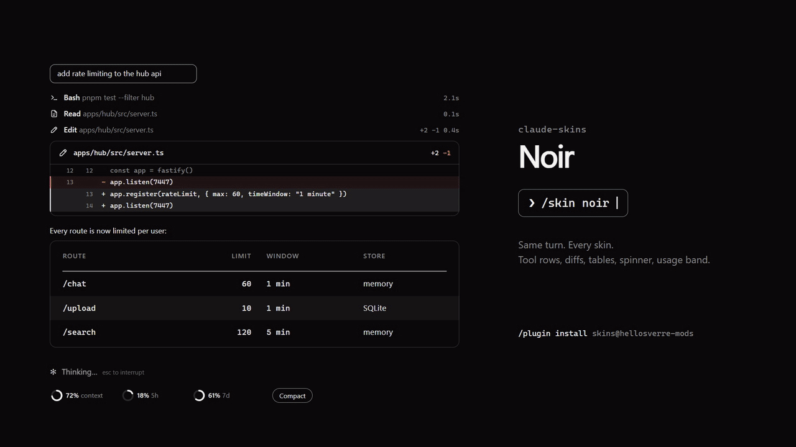

# claude-skins

A modern skin for Claude Code. A [mod](https://code.claude.com/docs/en/plugins/mods/overview) that
redraws the transcript: tool calls with icons and timings, edits as diff cards, tables and code as
animated cards, shell output in a terminal card, a spinner that shows what Claude is doing, and a band
above the prompt with your context and plan limits and a Compact button. Fifteen skins, light and dark,
a settings page, and your own agent can design a new skin with you.



<picture>
  <source media="(prefers-color-scheme: light)" srcset="docs/previews/hero-light.svg">
  
</picture>

<picture>
  <source media="(prefers-color-scheme: light)" srcset="docs/previews/spinners-light.svg">
  
</picture>

<picture>
  <source media="(prefers-color-scheme: light)" srcset="docs/previews/terminal-light.svg">
  
</picture>

<picture>
  <source media="(prefers-color-scheme: light)" srcset="docs/previews/code-light.svg">
  
</picture>

<picture>
  <source media="(prefers-color-scheme: light)" srcset="docs/previews/usage-light.svg">
  
</picture>

These previews are drawn by the mod's own card code (`scripts/previews.ts`), not screenshots.

## Install

Needs Claude Code 2.1.287 or later, in a terminal or the desktop app's Code tab.

```
/plugin marketplace add hellosverre/claude-skins
/plugin install skins@hellosverre-mods
```

## What it redraws

| Site | Desktop app | Terminal |
|---|---|---|
| Tool calls | A line icon per kind, a spinning ring while it runs, lines changed and time taken | A node on the turn's rail with the same facts |
| Edits | A diff card: file, `+N −M`, numbered changed lines in green and red | Claude Code's own diff |
| Shell commands | A terminal card: status pill, output with stderr apart, long output folded, and a Copy button for the output | Claude Code's own output |
| Quiet output (off by default) | Reads, searches and read-only shell commands (`git status`, `rg`, `ls`, `sed -n`) are one plain row, `Searched`, `Looked`, with nothing under it; a failure keeps its one error line. Anything that might write keeps its output | The same |
| Tables in replies | An animated card: header rule, zebra rows, swatches for colours, coloured diffs; Copy gives the markdown | A cell grid with a header band and zebra rows, and the same Copy |
| Alerts and task lists in replies | `> [!NOTE]` and its kin as a coloured, titled box; `- [ ]` lists with ticks and a done count | The same |
| Prose in replies | Claude Code's own markdown | Headings with a mark, and numbers, versions, paths and durations picked out in the skin's colours; links and anything unusual stay Claude Code's |
| Charts in replies (on by default) | A ` ```mermaid ` fence drawn as a card in the skin's colours, rising in: flowchart, `xychart-beta`, `pie`, `gantt`, `timeline`, `journey`, `kanban`, `mindmap`, `quadrantChart`, `radar-beta`, `sankey-beta` and `gitGraph`. Copy gives the source. Claude is told it can answer with one | The same twelve in cells: a laid-out flowchart with real arrows, gantt bars on a date axis, a braille radar, sankey flows as share bars, git lanes with merge and cherry-pick glyphs; sequence, state, class and ER diagrams too. With `/skin icons ascii` they are drawn in plain ASCII. One too wide for the window falls back to rows |
| Code blocks in replies | A card with the language, line numbers and highlighting, and a Copy button | Claude Code's own markdown, and a Copy button |
| Spinner | An animated icon per phase: thinking, tool use, writing, waiting | The skin's word with a band of light through it |
| Above the prompt | Rings for context and each plan limit, a Compact button, and a nudge to compact from 70% context | Block meters and the same button |
| Turn footer | (not raised on desktop) | Time, tool count and lines changed |
| Your prompts | A rounded outline sized to what you typed; attached images stay below it | The same |
| The question dialog | A band naming its topics above Claude Code's own dialog | The same |

Every card rises in row by row and respects reduced motion. A skin only changes what is drawn: the stored
conversation, and what the model reads, are untouched. Agents, plan mode and the permission prompt keep
Claude Code's own drawing. The default skin is **noir**, black and white. Cards have no background of
their own, so they sit in the page. On a light Claude Code theme every skin switches to its light palette. With the `auto` theme it
follows your terminal's background (`COLORFGBG`) or, failing that, the system's light or dark mode.
Set `SKINS_THEME=light` or `SKINS_THEME=dark` to choose yourself, for example when you launch with
`claude --settings '{"theme":"dark"}'`, which skins cannot see.

## Make it yours

- **`/skin`** opens the settings: pick a skin, see a live preview, switch the rail, tables, shimmer,
  band, markdown, quiet output, charts and icons, and repaint any colour. Repainting a built-in skin saves it as your own `my-<skin>`.
- **`/skin gallery`** shows every element the skin draws, numbered, to point at when you want one changed.
- **Ask your agent.** The mod gives Claude a `design` tool and a short guide, so "make me a skin that
  feels like a sunset" builds one and applies it while you watch.
- **`/skin <name>`**, `/skin list`, `/skin off`, and `/skin rail|tables|shimmer|band|clip|markdown|quiet|charts on|off` for quick switches.
- **`/skin copy`** puts Claude's last reply on the clipboard; **`/skin copy code`** just its last code block.
- **`/skin pin`** gives this folder a look of its own: later changes here stay here. **`/skin unpin`**
  returns it to the default, and **`/skin share`** makes this folder's look the default for the rest.
  Made skins are shared by every folder.

Your choices are remembered across sessions.

## What it can reach

It draws and remembers. It reads the session's directory, your context and plan usage, Claude
Code's theme setting and the `SKINS_THEME` and `COLORFGBG` variables; keeps its settings in the mod store; registers one tool for your agent; and
compacts only when you press Compact, and copies only when you press Copy. With the `auto` theme it asks the system for its appearance (`defaults read -g AppleInterfaceStyle`
on macOS, `gsettings get org.gnome.desktop.interface color-scheme` on GNOME); it starts no other
process, touches no file and makes no network call.
Check it yourself:

```bash
claude plugin validate .
```

## Add a built-in skin

A skin is one file. Copy `hooks/themes/nord.ts`, change the colours and words, then add one line to
`hooks/themes/index.ts`.

```bash
claude plugin test
```

## Vendored code

Terminal diagrams are laid out by [beautiful-mermaid](https://github.com/lukilabs/beautiful-mermaid)
(MIT), bundled into `hooks/vendor/mermaid-ascii.js` with its licence in the header. To rebuild it:

```bash
cd scripts/vendor && npm install && npm run build
```

## Develop

```bash
claude --plugin-dir .
```

Saving a file reloads the mod in the running session. `/plugin-types` writes the type declarations
into `.claude/types` for your editor. `npx tsx scripts/previews.ts` redraws the README previews.

## License

MIT
